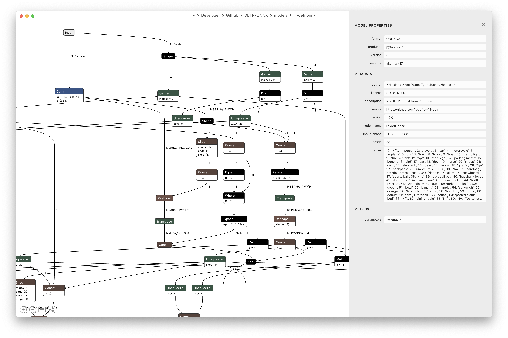

DETR models in ONNX format
==========================

## Model Zoo

Algorithm|Supported|Year|Github Link|Note
--|--|--|--|--
DETR|✅|2020|[Link](https://github.com/facebookresearch/detr)
Deformable-DETR|✅|2021|[Link](https://github.com/fundamentalvision/Deformable-DETR)
LW-DETR|✅|2024|[Link](https://github.com/Atten4Vis/LW-DETR)
RT-DETR|✅|2024|[Link](https://github.com/lyuwenyu/RT-DETR)|Use focal loss
RF-DETR|✅|2025|[Link](https://github.com/roboflow/rf-detr)
DEIMv2|✅|2025|[Link](https://github.com/Intellindust-AI-Lab/DEIMv2)|Use focal loss

Download weights from [Release](https://github.com/zhouzq-thu/DETR-ONNX/releases), then put them into `models` folder.

> **NOTE**: The ONNX models already fused the image normalization using mean = [0.485, 0.456, 0.406] and std = [0.229, 0.224, 0.225].

## Model info

The input shape of these models are dynamic (batch size and image size).

- Inputs:
  - input: ['N', 3, 'H', 'W'] (FLOAT)
- Outputs:
  - logits: ['N', 300, 80 or 91 or 301] (FLOAT)
  - boxes: ['N', 300, 4] (FLOAT)

Some models use focal loss instead of cross entropy loss.

You can view ONNX models with [netron](https://github.com/lutzroeder/netron), which can visualize the shape of each layer.


With `onnxruntime`, you can use the following script to get some model infos.

```python
import onnxruntime as ort

sess = ort.InferenceSession(model_path)
input_name = sess.get_inputs()[0].name
output_names = [output.name for output in sess.get_outputs()]
input_shape = sess.get_inputs()[0].shape
meta = sess.get_modelmeta().custom_metadata_map
stride = int(meta.get('stride', -1))
class_names = eval(meta.get('names', '{}'))
```

## Usage

### python
```python
import cv2 as cv
from detr_onnx import DetrONNX

model_path = "models/rt-detrv2.onnx"
detr = DetrONNX(model_path)

img = cv.imread("images/kite.jpg")
prob, boxes = detr.detect(img)
res = detr.plot_result(img, prob, boxes)

cv.imshow("res", res)
cv.waitKey(0)
```

### C++

```sh
mkdir build && cd build
cmake ../cpp
# Usage: ./build/detr_onnx <model_path> <image_path>
```
